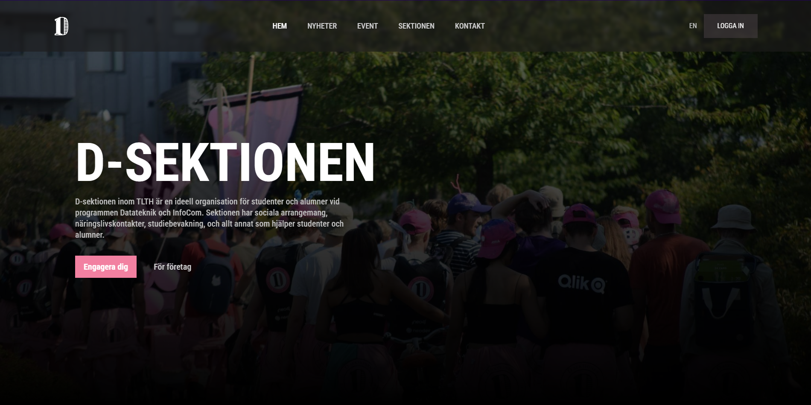
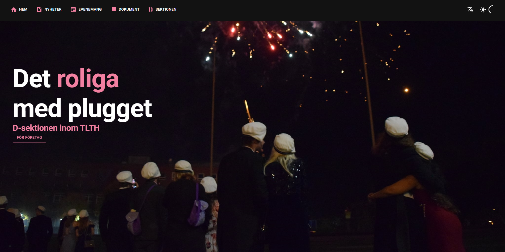
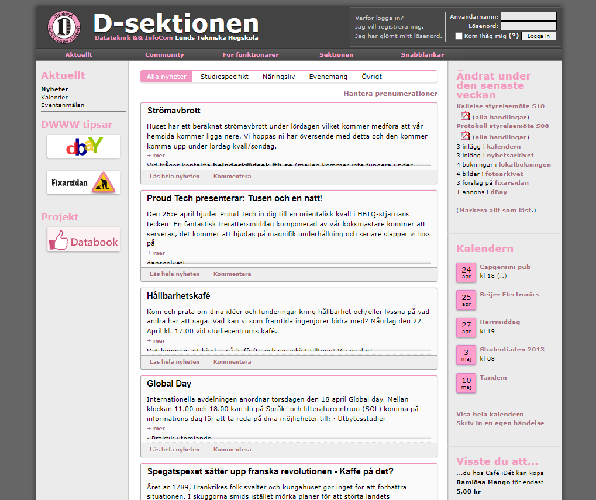
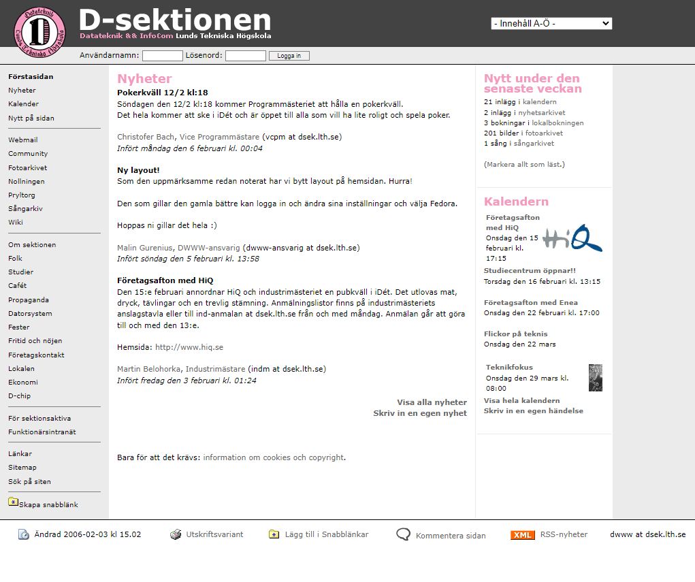
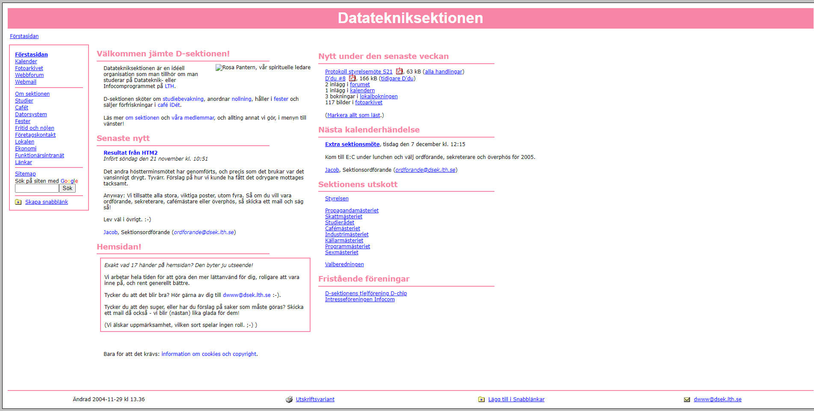
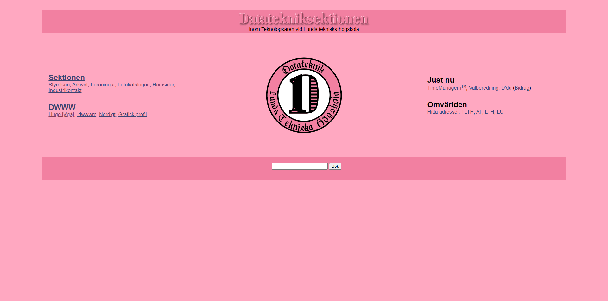
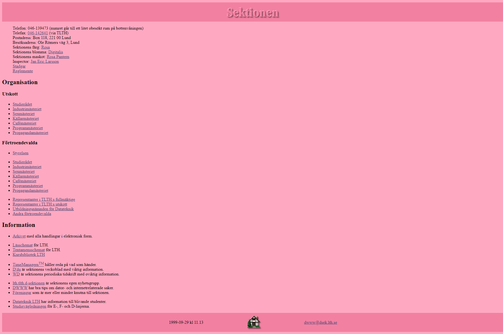
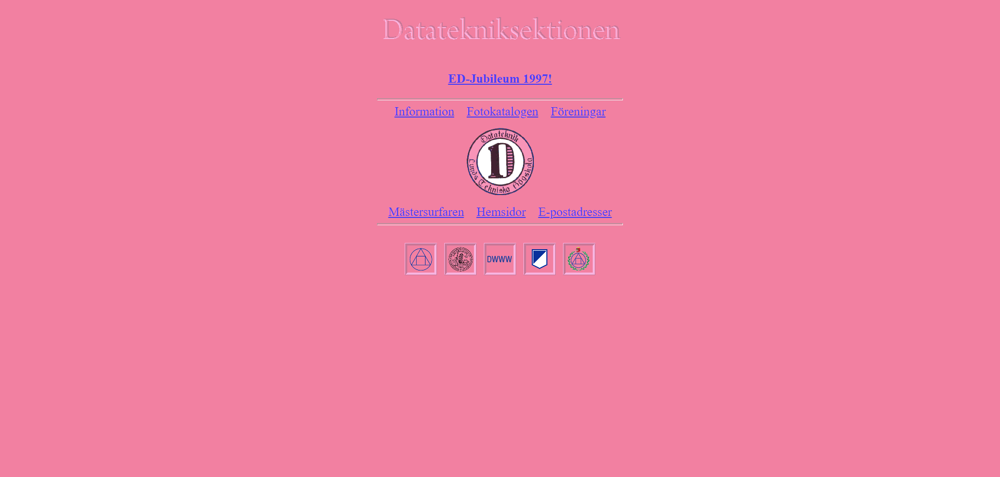

# Tidslinje

Nedan följer en tidslinje över D-sektionens webbsida. Den bygger vidare på den ursprungliga tidslinjen som finns arkiverad på [web.archive.org](https://web.archive.org/web/19981202185436/http://www.efd.lth.se/proj/dsek/dwww.html). Notera att det kan finnas luckor och felaktigheter i tidslinjen. Mycket har gått förlorat till historien.

- 2024-11-01 Snapshot av webbsidan på `dsek.se`
  
- 2023-01-01 [Daniel Adu-Gyan](https://www.dsek.se/members/ad2313ad-s) ny ansvarig för DWWW.
- 2022-12 En ny version av webbsidan publicerars. Snapshot nedan av `dsek.se`
  
- 2022-01-01 [Oliver Levay](https://www.dsek.se/members/ol1662le-s) ny ansvarig för DWWW.
- 2021-01-01 [Noah Mayerhofer](https://www.dsek.se/members/no1774ma-s) ny ansvarig för DWWW.
- 2020-01-01 [Emil Wihlander](https://www.dsek.se/members/dat15ewi) ny ansvarig för DWWW.
- 2019-01-01 [Viktor Claesson](https://www.dsek.se/members/dat15vcl) ny ansvarig för DWWW.
- 2014-01-01 [Mattias Eklund](https://www.dsek.se/members/mat10mek) ny ansvarig för DWWW.
- 2013-04-19 Snapshot av webbsidan på sin nya domän `dsek.se`
  
- 2013-01-01 [Jacob Gradén](https://www.dsek.se/members/d01jg) och [Simon Hillbom](https://www.dsek.se/members/ada10shi) nya ansvariga för DWWW.
- 2011-01-01 [Erik Westrup](https://www.dsek.se/members/dt09ew6) ny ansvarig för DWWW.
- 2010-01-01 [Daniel Perván](https://www.dsek.se/members/dt08dp1) och [Fredik Karlsson](https://www.dsek.se/members/dt08fk6) nya ansvariga för DWWW.
- 2009-01-01 [Fredrik Karlsson](https://www.dsek.se/members/dt08fk6) och [Jacob Gradén](https://www.dsek.se/members/d01jg) nya ansvariga för DWWW.
- 2007-01-01 [Caroline Schmidt](https://www.dsek.se/members/d04cs) ny ansvarig för DWWW.
- 2006-02-05 Webbsidan får ny layout. Snapshot nedan av `dsek.lth.se`
  
- 2006-01-01 [Malin Gurenius](https://www.dsek.se/members/d03mg) ny ansvarig för DWWW.
- 2004-12-03 Snapshot av webbsidan med ny layout på `dsek.lth.se`
  
- 2004-09-13 [Andreas Back](https://www.dsek.se/members/d01ab) ny ansvarig för DWWW.
- 2001-04-18 Snapshot av webbsidan på sin nya domän `dsek.lth.se`
  
- 2000-01-01 [Magnus Bäck](https://www.dsek.se/members/d98mba) ny ansvarig för DWWW.
- 1999-10-07 Snapshot av informationssidorna på `efd.lth.se/proj/dsek/sektionen`
  
- 1999-01-01 [Fredrik Roubert](https://web.archive.org/web/19981202185436/http://www.efd.lth.se/~d95fr/) ny ansvarig för DWWW.
- 1998-04-03 Informationssidorna storstädade och uppdaterade.
- 1998-04-02 D97:orna börjar synas på väven - [fotokatalogen](https://web.archive.org/web/19981202185436/http://www.efd.lth.se/proj/dsek/folk/foto/d97/) byggs upp.
- 1998-01-01 [Tobias Berg](https://web.archive.org/web/19981202185436/http://www.df.lth.se/~toby/) ny ansvarig för DWWW.
- 1997-02-08 [Marie Nilsson](https://web.archive.org/web/19981202185436/http://www.efd.lth.se/~d95mni/) ny ansvarig för DWWW.
- 1997-01-29 Snapshot av webbsidan på `efd.lth.se/proj/dsek`
  
- 1996-11-20 Alla gamla och inaktuella sidor borta.
- 1996-11-06 Fotokatalogen nu på WWW.
- 1996-03-28 Förbättrad design av hemsidan. Mycket snyggare nu!
- 1996-03-18 [Fredrik Roubert](https://web.archive.org/web/19981202185436/http://www.efd.lth.se/~d95fr/) ny ansvarig för DWWW.
- 1996-02-29 Nya medlemmar [Tobias Jönsson](https://web.archive.org/web/19981202185436/http://www.efd.lth.se/~d95tj/), [Henrik Andersson](https://web.archive.org/web/19981202185436/http://www.efd.lth.se/~d95ha/) och [Fredrik Roubert](https://web.archive.org/web/19981202185436/http://www.efd.lth.se/~d95fr/).
- 1995-10-08 Större omdaning av D:s homepage.
- 1995-09-28 Nya medlemmar [Jan-Erik Malmquist](https://web.archive.org/web/19981202185436/http://www.efd.lth.se/~d93jm/), [Martin Nilsson](https://web.archive.org/web/19981202185436/http://www.efd.lth.se/~d94mni/) och [Jakob Melander](https://web.archive.org/web/19981202185436/http://www.efd.lth.se/~d94jm/).
- 1995-02-22 [Jörgen Persson](https://web.archive.org/web/19981202185436/http://www.efd.lth.se/~d93jp/) ny ansvarig för DWWW.
- 1995-01-01 [Peter Kjellerstedt](https://web.archive.org/web/19981202185436/http://www.efd.lth.se/~d92pk/) ny ansvarig för DWWW. Nya medlemmar [Andreas Richter](https://web.archive.org/web/19981202185436/http://www.efd.lth.se/~d93ari/) och [Jörgen Persson](https://web.archive.org/web/19981202185436/http://www.efd.lth.se/~d93jp/).
- 1994-10-03 [Daniel Ripoll](https://web.archive.org/web/19981202185436/http://www.efd.lth.se/~d94dr/) och [Dan Gustafsson](https://web.archive.org/web/19981202185436/http://www.efd.lth.se/~d94dgu/) med i DWWW!
- 1994-08-21 Uppdatering efter sommaren. Fått beröm från Ericsson, yrkesverksamma fd D-elever.
- 1994-04-21 [Andreas Moestedt](https://web.archive.org/web/19981202185436/http://www.efd.lth.se/~d90am/) med i DWWW.
- 1994-04-21 DWWW har en mailinglista: dsek-www
- 1994-04-13 Större omdaning av D:s HomePage. Bollar å sånt.
- 1994-04-12 Patrik Ryd med i DWWW; vår Driftgrupp.
- 1994-04-03 Brev från Statssekreteraren: Regeringskansliet använder vår länksida.
- 1994-03-11 Föddes D-sektionens WWW. Lars Bratthall vårdade ömt.

::: info Visste du att?
D-sektionens webbsida var antagligen den första studentdrivna websidan i Sverige (och antagligen även i Europa).
:::
