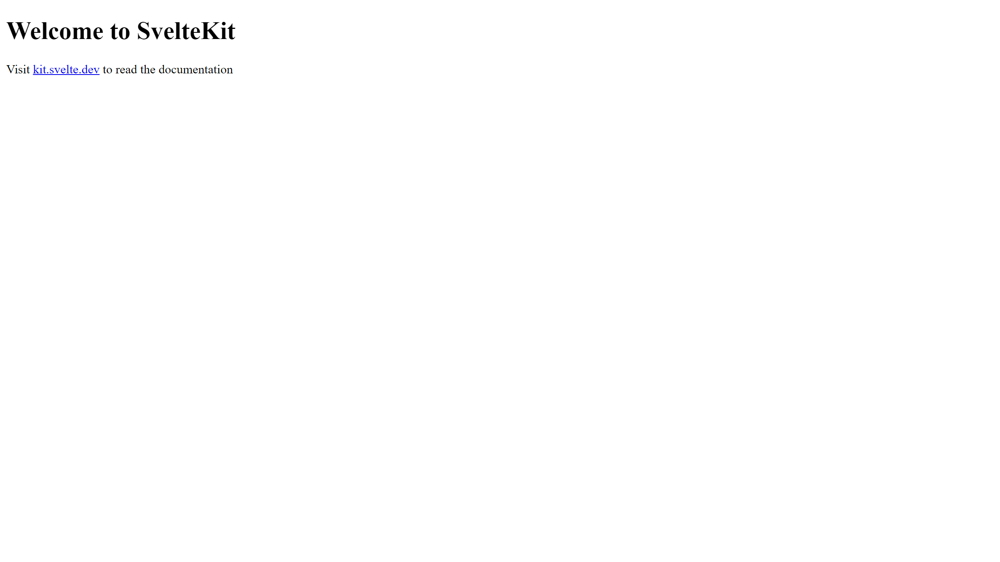

# Svelte

Svelte is a tool used to build web applications. In this Svelte tutorial, we will create a simple to-do list application. Along the way we will encounter some of the core concepts of Svelte such as _components_ and _logic blocks_.

For a more in-depth tutorial, visit the official Svelte tutorial at [learn.svelte.dev](https://learn.svelte.dev/).

## Setting up our project

1. Let's start by setting up a new empty Svelte project. Run the following commands in your terminal and follow along with the prompts:

```bash
cd /tmp # or any other directory
pnpm create svelte@latest my-app
```

2. Create a new Skeleton project.

```bash
◆  Which Svelte app template?
│  ○ SvelteKit demo app
│  ● Skeleton project # [!code highlight]
│  ○ Library project
```

3. Use TypeScript for type checking.

```bash
◆  Add type checking with TypeScript?
│  ● Yes, using TypeScript syntax # [!code highlight]
│  ○ Yes, using JavaScript with JSDoc comments
│  ○ No
```

4. Add ESLint for code linting and Prettier for code formatting

```bash
◆  Select additional options (use arrow keys/space bar)
│  ◼ Add ESLint for code linting # [!code highlight]
│  ◼ Add Prettier for code formatting # [!code highlight]
│  ◻ Add Playwright for browser testing
│  ◻ Add Vitest for unit testing
│  ◻ Try the Svelte 5 preview (unstable!)
```

5. Once the project is created, open it in VS Code:

   ```bash
   code my-app
   ```

6. Finally, open the integrated terminal in VS Code, install all dependencies and start the development server:

   ```bash
   pnpm install
   pnpm run dev -- --open
   ```

7. You should now see the default Svelte app running [in your browser](http://localhost:5173)!
   

## Building our to-do list

1. Open the `src/routes/+page.svelte` file in VS Code and replace the contents of the file with the following code. You can replace `"Ada"` with your own name. Save the file and you should see the changes reflected in your browser.

   ::: code-group

   ```svelte [+page.svelte]
   <h1>Ada's to-do list</h1>

   <ul>
     <li>Learn Svelte</li>
     <li>Build something cool</li>
     <li>Take over the world</li>
     <li>Profit</li>
   </ul>
   ```

   :::

2. We will suffix today's date to the title of the to-do list.

   ::: code-group

   ```svelte [+page.svelte]{1-5}
   <script lang="ts">
     const date = new Date();
   </script>

   <h1>Ada's to-do list - {date}</h1>

   <ul>
     <li>Learn Svelte</li>
     <li>Build something cool</li>
     <li>Take over the world</li>
     <li>Profit</li>
   </ul>
   ```

   :::

   For a more readable date format we can even use the `toLocaleDateString` method.

   ```svelte
   <h1>Ada's to-do list - {date.toLocaleDateString()}</h1>
   ```

3.
